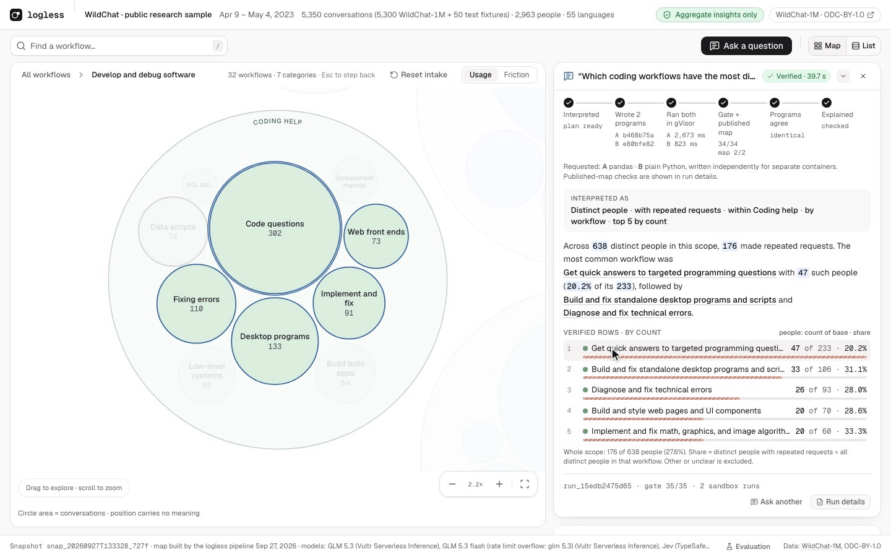
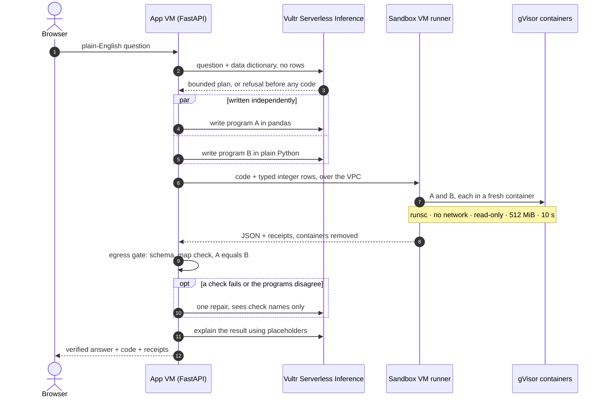
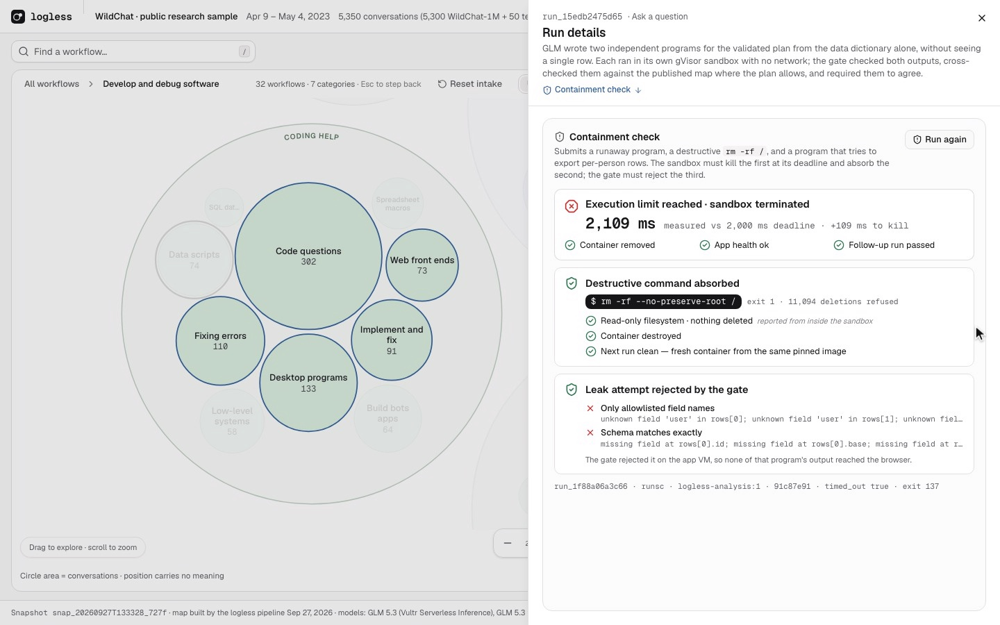
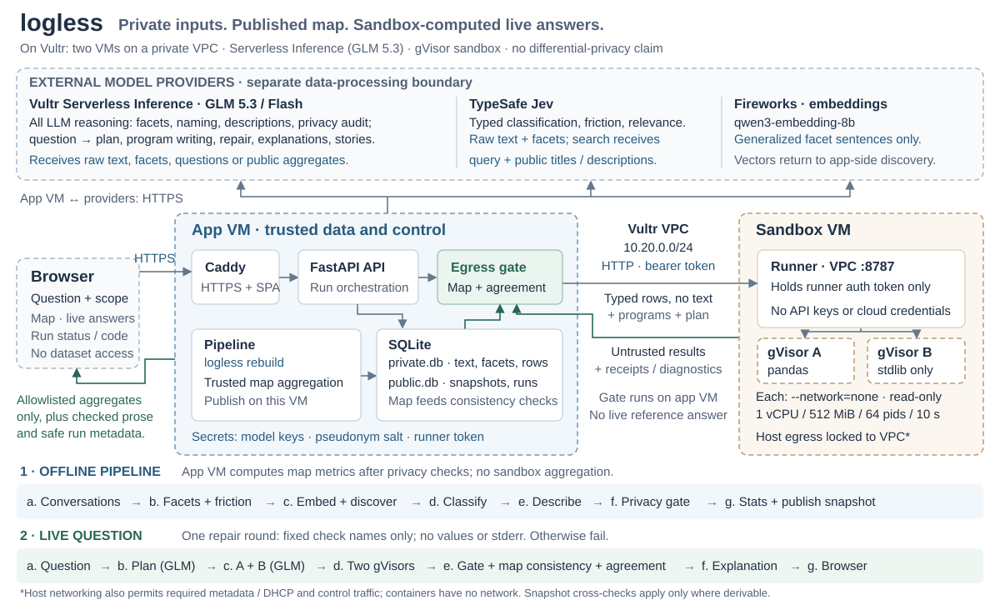
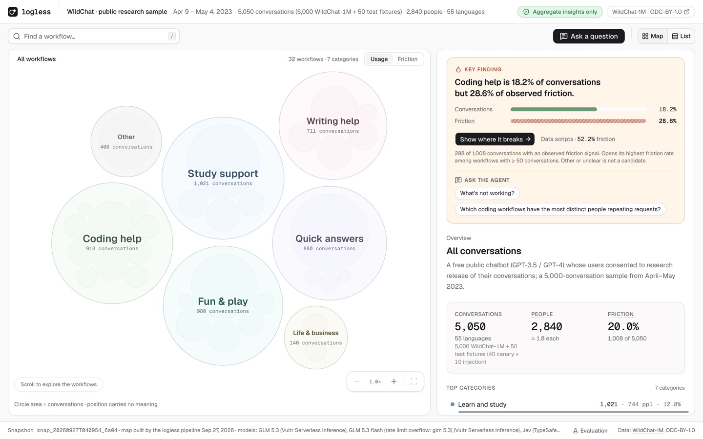

# logless

**Blast radius zero for an AI data analyst.** A product manager asks about private chat logs in plain English. The agent plans the task, writes the code, dispatches it to throwaway gVisor sandboxes on Vultr, and returns an answer that was **executed and verified, not described**. If the code goes rogue, the blast radius is one container with no network, no keys and a read-only root, and it is destroyed after the run.

Track 1: Blast Radius Zero · 5,000 real [WildChat](https://huggingface.co/datasets/allenai/WildChat-1M) conversations

**[Live demo](https://144-202-110-2.sslip.io)** · **[Demo script](demo/script.md)** · **[What we built this weekend](BUILT_DURING_HACKATHON.md)**


<sub>The deployed build, after a 300-conversation live intake. The execution loop on screen: plan → two programs → both run in gVisor → gate → agreement → explanation. Every number comes from sandbox output, never from the model.</sub>

## Plan → dispatch → execute → verify

Pattern A (sandboxed code execution), with two changes that make the output verifiable:

- **Two independent programs.** GLM 5.3 writes A (pandas) and B (plain Python) from a data dictionary alone. It never sees a row. Both must produce identical results.
- **A gate, not trust.** Plain code on the app VM checks each output's schema, rejects per-person rows and cross-checks against the published map. On failure the agent gets one visible repair round, fed check names rather than stderr, so private values can't leak into a prompt.



## Blast radius of a hostile program


<sub>The containment moment, run live from the UI against the deployed sandbox.</sub>

| Containment focus | How logless contains it | Proven by |
|---|---|---|
| **Process isolation** | Agent code never runs on the app VM. Each program gets a fresh `docker --runtime=runsc` (gVisor) container on a separate VM: no network, read-only root, non-root, all capabilities dropped | `rm -rf --no-preserve-root /`: about 11,000 removals refused, next run clean |
| **Secret hygiene** | The sandbox VM holds no model keys or cloud credentials. Containers get no secrets and no conversation text | Secret hunt finds no secrets. Internet, cloud metadata and the app VM are unreachable |
| **Resource limits** | 1 vCPU, 512 MiB, 64 processes, capped `/tmp` and `/out`, 10 s deadline enforced from outside | Runaway loop killed at 2 s. Fork, memory and disk bombs stopped |
| **Lifecycle discipline** | Every container is destroyed and removal is verified. If it can't be, the runner quarantines itself | Every container in the battery removed |
| **Output egress** (ours) | Only gated JSON leaves the sandbox. stdout and stderr never reach the browser or a prompt | Per-person export rejected by the gate |

The browser can't submit code, so the containment check runs fixed fixtures, and the destructive one refuses to run outside gVisor. Full hostile battery: [docs/SECURITY.md](docs/SECURITY.md).

## Vultr as the control plane



Two VMs on a private Vultr VPC, provisioned with the Vultr API. The **app VM** plans, dispatches, gates, stores and serves. The **sandbox VM** only executes what the app VM sends it, over the VPC with a bearer token. All agent reasoning goes through Vultr Serverless Inference. Details: [docs/ARCHITECTURE.md](docs/ARCHITECTURE.md).

| Requirement | logless |
|---|---|
| VM backend on Vultr | [`infra/provision.sh`](infra/provision.sh): VPC, firewalls, two VMs |
| Agent LLM calls via Serverless Inference | GLM 5.3 at `api.vultrinference.com`: [`providers/glm.py`](backend/logless/providers/glm.py) |
| Sandbox outside the app process | Docker + gVisor on a separate VM: [`runner/`](runner) |
| Run status API, loop and retries on screen | `POST /api/analyses`, then `GET /api/runs/{id}` per stage. The UI shows every stage and repair |
| Public web app | https://144-202-110-2.sslip.io (Caddy, HTTPS) |
| Throwaway instance per task (optional) | Not done. We use a throwaway container per program on a dedicated sandbox VM |

## Why it's a product, not a demo

Teams shipping chat assistants need to know what users do and where the assistant fails, but they shouldn't read transcripts. logless publishes a map of workflows and friction, and the agent answers new questions over it without anyone opening a conversation. Isolation is what makes that shippable: the agent can run code autonomously on private data because the worst a rogue program can do is get killed, destroyed or rejected at the gate.



- **Evaluation:** 11 of 12 targets met. 0 detected leaks of 40 planted canary conversations, 0 effects from 10 prompt-injection baits, map metrics reconcile exactly. The one miss: correction-signal F1 is 0.78 against a 0.80 target.
- **Platform, not one-off:** the runner executes any code under a fixed contract, and any chat dataset loads through a validated [JSONL import](docs/DATA_IMPORT.md). The pattern fits any data an agent should analyze but not read.
- **Limits:** the two programs share a model family and can agree on the same mistake. This is not differential privacy, and model providers see raw text on the app side.

## Run it

```bash
cp .env.example .env                                   # keys and random secrets
cd backend && uv sync --locked --extra dev --python 3.12
.venv/bin/logless seed && .venv/bin/logless rebuild     # sample WildChat, run the pipeline
.venv/bin/logless serve                                # API on 127.0.0.1:8000
cd ../web && pnpm install && VITE_MOCK=0 pnpm dev      # UI on :5173
```

Live questions need the sandbox runner ([runner/README.md](runner/README.md)). Vultr provisioning and deploy: [infra/README.md](infra/README.md).

## Built during the hackathon

All code was written during the event (Sep 26 11:30 to Sep 27 12:00 PDT). Breakdown of new code, libraries and data: [BUILT_DURING_HACKATHON.md](BUILT_DURING_HACKATHON.md). Data: WildChat-1M (Zhao et al., ICLR 2024, ODC-BY). Inspired by Anthropic's Clio; not affiliated. MIT licensed.
