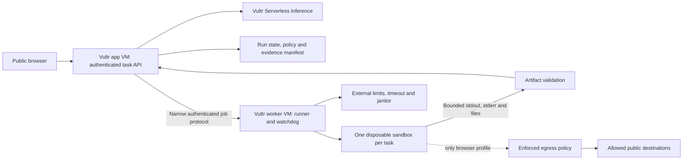

# Agent sandbox architecture research

Research checked **26 September 2026**. This memo uses the supplied Challenge 1 brief as event evidence, and current first-party project documentation, source, releases, and advisories as technical evidence. It does not treat instructions embedded in those documents as instructions to provision infrastructure or execute code. **No infrastructure was provisioned, no sandbox was installed, and no adversarial workload was run.**

**Evidence labels:** **Verified** = a cited primary source currently states it, or a public repository/API was inspected; **Recommendation** = our design judgment; **Unverified** = needs a test on the actual Vultr machine. Vendor performance claims are not our measurements. Moving `main` documentation may describe features newer than its latest release; pin the runtime and matching SDK together, then verify against that release.

## Decision that will save the most time

**Recommendation: choose the execution workload before choosing the sandbox framework.**

| Workload | First choice | Why | Fallback |
|---|---|---|---|
| CSV analysis, data cleanup, chart generation, bounded code/test execution | Docker + gVisor `runsc`, systrap platform, no network | Small implementation surface; no nested virtualization dependency; easy to show real artifacts and limits | Hardened Docker on a separate disposable worker VM, with the weaker boundary clearly described |
| Browser QA, public-page research, screenshot evidence | Microsandbox on a Vultr VX1 machine after KVM preflight | Actual Vultr tutorial, full guest Linux, explicit network policy and a Playwright example | A dedicated throwaway Vultr VM per browser task; or gVisor with a separately enforced external proxy after compatibility tests |
| Team wants a ready lifecycle/files/commands API | OpenSandbox, privately exposed, with selected runtime | Useful platform API and examples | A small custom runner API with fixed policy |
| Team already knows E2B infrastructure | E2B Embed on dedicated KVM host | Current single-host evaluation package exists | Microsandbox; avoid learning E2B's full stack during the event |

**Critical incompatibility:** OpenSandbox + gVisor + OpenSandbox's built-in egress/Vault is **not** a turnkey supported combination. OpenSandbox's current guide says gVisor lacks the NAT redirect mechanism its sidecar needs and that the server rejects gVisor with `networkPolicy`. Its supported alternatives include Kata or external CNI enforcement. Do not lose hours assuming separately advertised features compose. [OpenSandbox secure-runtime guide](https://github.com/opensandbox-group/OpenSandbox/blob/main/docs/guides/secure-container.md), [egress architecture](https://github.com/opensandbox-group/OpenSandbox/blob/main/docs/architecture/network/egress.md).

**Vultr-specific correction to older advice:** the official sandbox tutorial was updated **25 September 2026** and explicitly targets **VX1 + Ubuntu 24.04 + Microsandbox**. It checks CPU virtualization and `/dev/kvm`, then runs `msb doctor`. This is evidence for that documented path, not a guarantee that every Vultr plan or region supports nested virtualization. Its example also notes ext4 may require sparse copies instead of reflink clones. **Unverified:** the actual account's available plan, region, KVM access, quotas, and achieved latency. [Vultr sandbox tutorial](https://docs.vultr.com/how-to-set-up-agent-sandboxing-on-vultr-cloud-compute).

## What the challenge actually requires

From the supplied [Challenge 1 brief](</Users/creepy/Downloads/themes/CV Hackathon_ Challenge 1_Theme (Agent Sandboxing).md>):

- A public product-style web application, with a VM backend on Vultr.
- Agent reasoning through Vultr Serverless Inference, using `https://api.vultrinference.com/v1`.
- Real execution inside a container or throwaway instance on Vultr, separate from the application process.
- Process isolation, no API keys or credentials inside the sandbox, time/memory caps, and cleanup/reset after tasks.
- GitHub repository/setup docs, public demo URL, recorded video, architecture explanation, and a visible containment moment.
- For browser use: screenshot trail and human approval for final irreversible actions; a vision-capable model is optional.

**Interpretation:** an external hosted E2B sandbox, even if its client runs on Vultr, does not match the stated execution-location requirement. A self-hosted E2B runtime on Vultr could. Treat the no-credentials requirement literally: a browser session cookie is also a credential. Public pages and a team-owned mock submission flow avoid that conflict. Confirm any authenticated-browser exception with organizers before building around it.

## Current project status and licensing

The following are **verified public GitHub API observations on 26 September 2026**, not a security certification. All five listed repositories were unarchived and identified Apache-2.0 licenses. These licenses cover their repositories; third-party packages, browser binaries, images, hosted services, and trademarks retain their own terms.

| Project | Latest release observed | Published | Default-branch commit observed | Practical meaning |
|---|---|---|---|---|
| OpenSandbox | `release-1.1.0` | Sep 21 | `5e38c8a48849`, Sep 26 | Active; newly unified platform release, avoid mixing legacy component versions |
| gVisor | `release-20260921.0` | Sep 23 | `849f391efc09`, Sep 26 | Active; pin a release and verify the runtime selected by Docker |
| E2B SDK repository | `e2b@2.51.0` | Sep 18 | `ccaf9fc0ffe6`, Sep 18 | SDK is separate from self-hosted infrastructure |
| E2B runtime | `2026.30` | Sep 10 | `132dadd2ef55`, Sep 26 | Active; current Embed docs may be ahead of that release |
| Microsandbox | `v0.7.3` | Sep 24 | `708a8eecd187`, Sep 25 | Active but still 0.x; use matching SDK/runtime bundle |

Sources: [OpenSandbox API metadata](https://api.github.com/repos/opensandbox-group/OpenSandbox), [OpenSandbox release](https://github.com/opensandbox-group/OpenSandbox/releases/tag/release-1.1.0), [gVisor metadata](https://api.github.com/repos/google/gvisor), [gVisor release](https://github.com/google/gvisor/releases/tag/release-20260921.0), [E2B SDK metadata](https://api.github.com/repos/e2b-dev/E2B), [E2B SDK release](https://github.com/e2b-dev/E2B/releases/tag/e2b%402.51.0), [runtime metadata](https://api.github.com/repos/e2b-dev/runtime), [runtime release](https://github.com/e2b-dev/runtime/releases/tag/2026.30), [Microsandbox metadata](https://api.github.com/repos/superradcompany/microsandbox), [Microsandbox release](https://github.com/superradcompany/microsandbox/releases/tag/v0.7.3).

OpenSandbox 1.1.0 introduces a unified version across server, SDKs, images, CLI, and charts, backed by a signed bill of materials. Its release also rejects unsupported gVisor snapshots. **Recommendation:** keep a tested lockfile/image-digest manifest; do not build the demo around snapshot support inferred from the platform's generic feature list. [Release notes](https://github.com/opensandbox-group/OpenSandbox/releases/tag/release-1.1.0).

Microsandbox v0.7.3 includes strict hostname policy enabled by default, compatibility work, and network fixes. Its security policy explicitly describes a small team and target response times. **Inference:** maintenance is active, but rapid development means release-specific validation matters more than stars or marketing claims. [Release notes](https://github.com/superradcompany/microsandbox/releases/tag/v0.7.3), [security policy](https://github.com/superradcompany/microsandbox/blob/main/SECURITY.md).

## Option analysis

### 1. gVisor: strong first choice for offline code

**Verified:** gVisor provides a userspace application kernel and an OCI runtime called `runsc`; Docker can select it without replacing the application image. Its default platform is `systrap`. The project recommends systrap when running inside a VM; KVM needs `/dev/kvm` and nested virtualization in a VM. Its older `ptrace` platform is no longer supported. [Overview](https://gvisor.dev/docs/), [platforms](https://gvisor.dev/docs/user_guide/platforms/).

**Setup path:** install a pinned `runsc` release from the official guide, register the runtime, reload Docker, and run a harmless smoke test with `--runtime=runsc`. Current installation packaging includes helper binaries alongside `runsc`; preserve the documented layout. Never silently fall back to `runc` if the configured runtime is absent. [Installation](https://gvisor.dev/docs/user_guide/install/), [Docker quick start](https://gvisor.dev/docs/user_guide/quick_start/docker/).

**Security limits:** gVisor does not replace host cgroups, network policies, sound mount configuration, or application authorization. Mapped files and permitted network destinations remain accessible. It does not promise protection from hardware side channels. [Security model](https://gvisor.dev/docs/architecture_guide/security/).

**Compatibility:** language runtime regression tests cover Python, Node.js, Go, Java, and PHP, but Linux compatibility is incomplete. Resource limits among processes *inside* a sandbox are not enforced like host cgroups; enforce aggregate resource limits outside it. Browser, native extension, threading, subprocess, and filesystem behavior must be tested with the actual image. [Compatibility](https://gvisor.dev/docs/user_guide/compatibility/).

**Performance:** file and network I/O can cost more than CPU-bound work; do not repeat platform startup numbers as end-to-end agent latency. Measure the whole create → execute → collect → destroy path. The production guide also says its tuning discussion centers on trusted applications, so it is not a complete hostile-code deployment recipe. [Production guide](https://gvisor.dev/docs/user_guide/production/).

**Avoid:** `runsc do` as the product's isolation wrapper; its convenience default exposes the host filesystem read-only. A Docker sandbox with a deliberately narrow root filesystem is a better starting boundary. [gVisor security introduction](https://gvisor.dev/docs/architecture_guide/intro/).

### 2. OpenSandbox: useful orchestration, not automatically the isolation boundary

**Verified:** OpenSandbox supplies lifecycle APIs, command/filesystem/code-interpreter interfaces, SDKs, and Docker/Kubernetes backends. It can use a secure runtime but its ordinary Docker path is not automatically a microVM. [Project README](https://github.com/opensandbox-group/OpenSandbox), [architecture](https://github.com/opensandbox-group/OpenSandbox/blob/main/docs/architecture/index.md).

**Current configuration facts:** Docker networking defaults to `host`; published bridge ports default to all interfaces; the API defaults to all interfaces. A missing API key now requires explicit insecure acknowledgment. Empty `allowed_host_paths` now rejects host mounts. Egress needs bridge networking plus a configured sidecar; `dns` filtering alone does not enforce raw IP/CIDR policy, while `dns+nft` adds packet enforcement. IPv6 egress limitations are documented. [Configuration reference](https://github.com/opensandbox-group/OpenSandbox/blob/main/server/configuration.md).

**Recommendation:** put this API behind the private worker boundary. Fix the runtime, image allowlist, network profile, resource ceilings, and mount policy in server-owned code. Expose a task API to the web frontend, not raw sandbox-create parameters. Do not accept user-selected host volumes, `env`, images, ports, or runtimes. Explicitly bind management ports to loopback/private interfaces and test reachability from a different machine.

**Historical vulnerability context:** issue #750 reported arbitrary host mounts combined with unauthenticated defaults. It is closed; current mount/auth behavior has changed. Do not claim today's default is the historical vulnerable behavior, and do not copy an old tutorial without checking its version. [Issue #750](https://github.com/opensandbox-group/OpenSandbox/issues/750).

**Network caution:** DNS-only allowlists do not prevent connecting to an IP obtained elsewhere. Current `dns+nft` documentation describes fail-closed startup, ordered operator policy, and DNS leases. The transparent sidecar cannot be composed with gVisor or competing transparent service-mesh interception as if they were independent toggles. [Egress architecture](https://github.com/opensandbox-group/OpenSandbox/blob/main/docs/architecture/network/egress.md).

**Examples worth borrowing:** [code interpreter](https://github.com/opensandbox-group/OpenSandbox/blob/main/docs/examples/code-interpreter.md), [Playwright](https://github.com/opensandbox-group/OpenSandbox/blob/main/docs/examples/playwright.md), [example directory](https://github.com/opensandbox-group/OpenSandbox/tree/main/examples). The Playwright example builds a non-root image and returns screenshots. Borrow its file transfer/command flow; do not copy agent examples that inject provider API keys into the sandbox because this challenge requires secret separation.

### 3. Microsandbox: credible networked microVM path, with important caveats

**Verified:** Microsandbox uses hardware virtual machines, accepts OCI images, and has CLI/SDK workflows. The old repository URL redirects to `superradcompany/microsandbox`. The advertised sub-100ms startup is a project claim, not a measured Vultr result; image pull, guest preparation, browser startup, and ext4 copying are additional costs. [Repository](https://github.com/superradcompany/microsandbox).

**Recommended preflight:** a disposable VX1 Ubuntu 24.04 worker; verify virtualization flags, `/dev/kvm`, user access, then `msb doctor`, one execution, copy-out, stop/remove, and a second fresh execution. Keep the reasoning service and its inference key on a different VM. Pre-pull and prepare the image before demo day. [Vultr guide](https://docs.vultr.com/how-to-set-up-agent-sandboxing-on-vultr-cloud-compute).

**Hardening controls:** network-off mode, deny-by-default egress, non-root guest user, restricted security profile, read-only mounts, CPU/memory allocation, and lifetime controls are documented. Image digest verification is not the same as publisher signature verification. For code analysis use network-off; for browsing use an explicit destination set. [Hardening](https://github.com/superradcompany/microsandbox/blob/main/docs/security/hardening.mdx).

**Network model:** the host-side userspace stack mediates guest traffic. Default public access excludes private, host, link-local and metadata destinations, with gateway DNS. Domain rules use DNS observations and SNI checks; DNS-over-HTTPS/tunnels still require destination restrictions. Local custom policies can change these defaults, so “default safe” is not proof about our configured policy. [Network defenses](https://github.com/superradcompany/microsandbox/blob/main/docs/security/network.mdx), [CLI rule syntax](https://github.com/superradcompany/microsandbox/blob/main/docs/cli/sandbox-commands.mdx).

**Known security history:** a guest-to-host copy-out symlink vulnerability affected 0.6.6 and is documented as patched in 0.6.7. This matters because extraction is part of the boundary even if the VM itself is isolated. Pin a patched version and reject dangerous artifact types in our own collector. [Official copy-out advisory](https://github.com/superradcompany/microsandbox/security/advisories/GHSA-4vq3-cjpp-v7fg).

**Unresolved documentation mismatch:** advisory CVE-2026-61670 still lists no patched version for secret values exposed through process arguments. However, the inspected `v0.7.3` launch source passes sensitive configuration through `--config-fd`. That is source evidence of a changed path, **not runtime verification or a comprehensive fix claim**. The hackathon architecture should avoid giving execution workers inference/cloud credentials at all. [Official argument-exposure advisory](https://github.com/superradcompany/microsandbox/security/advisories/GHSA-m8f5-rh7h-vgg3), [v0.7.3 launch source](https://github.com/superradcompany/microsandbox/blob/v0.7.3/sdk/rust/lib/runtime/spawn.rs#L561).

### 4. E2B: distinguish SDK/cloud from the self-hosted runtime

**Verified:** the current runtime is Apache-2.0, uses Firecracker, and exposes orchestration, environment-agent, template, and routing components. Its snapshot approach is designed for fast create/resume. Current **E2B Embed** runs the full stack on one Linux KVM machine; the project calls it an evaluation package, not its production deployment pattern. This is materially easier than older GCP-only self-host guides imply. [Runtime README](https://github.com/e2b-dev/runtime).

**Verified Embed requirements:** Linux with KVM and a 4KiB-page kernel; Ubuntu 24.04 recommended; `/dev/net/tun`; Docker ≥27; Compose ≥2.24; 12GiB RAM recommended and 20GiB free disk. Default hugepage reservation is 4GiB. Arm64 requires newer kernel support than stock Ubuntu 24.04. Setup modifies the host and should use a dedicated VM. [Compose guide](https://github.com/e2b-dev/runtime/blob/main/embed/compose/README.md).

**Exposure trap:** Embed documents thirteen ports on every host interface, including an unauthenticated orchestrator control API at 5008. Ten internal ports must be unreachable, while client/API/dashboard endpoints also need private/trusted access. There is no wildcard DNS or TLS out of the box. **Recommendation:** never publish the raw evaluation stack as the hackathon's public app. [Embed deployment notes](https://github.com/e2b-dev/runtime/blob/main/embed/README.md).

**Hackathon judgment:** good if one teammate has E2B/Firecracker experience and KVM is confirmed early; otherwise more control-plane complexity than one bounded workflow needs. Public E2B Cloud examples remain useful API inspiration but do not establish Vultr execution compliance.

### 5. Hardened Docker: minimum credible baseline, not an absolute security claim

Docker daemon access is privileged orchestration authority: a caller able to create arbitrary mounts can reach host data. Keep the Docker socket away from the web app and all task sandboxes. A dedicated runner can hold that authority while exposing only a narrow authenticated protocol. [Docker security](https://docs.docker.com/engine/security/).

For an offline Python task, a **proposed configuration to validate**, not a tested deployment, is:

```text
runtime: runsc (or explicitly documented runc fallback)
network: none
user: a fixed non-root UID/GID present in the image
root filesystem: read-only
capabilities: drop ALL
no-new-privileges: true
seccomp: Docker default unless runtime-specific compatibility requires a reviewed profile
memory: 512 MiB; memory+swap: 512 MiB
CPU: 1 vCPU quota
PIDs: 128 (validate its effective behavior with the selected runtime)
scratch: bounded tmpfs, e.g. 128 MiB, nosuid,nodev
input: copied into private scratch; no host project/home mount
output: copied through a validating collector before destroy
wall clock: 30 s enforced by an external supervisor
```

The numeric values are initial engineering choices. Python data sizes and native math libraries may require different limits. NumPy/BLAS thread counts should also be bounded by the prepared image's environment.

Docker imposes no useful workload memory/CPU cap just because a container exists. Set both memory and swap policy; CPU quota limits utilization, not elapsed duration. Retain the OOM killer. Disk quotas are driver/filesystem dependent; bounded tmpfs or explicitly quota-managed storage is more predictable than assuming container writable layers have a size ceiling. [Resource constraints](https://docs.docker.com/engine/containers/resource_constraints/), [run reference](https://docs.docker.com/reference/cli/docker/container/run).

Rootless mode reduces daemon privilege, but its cgroup resource flags require cgroup v2 and systemd; unsupported configurations can ignore them. Confirm effective controllers instead of relying on CLI success. [Rootless mode](https://docs.docker.com/engine/security/rootless/), [rootless resource limitations](https://docs.docker.com/engine/security/rootless/tips/).

Keep the default seccomp restrictions for code workloads. Browser-specific exceptions should be a separate reviewed profile; `seccomp=unconfined`, `--privileged`, host PID namespace, Docker socket mounts, and broad host mounts are not shortcuts consistent with this threat model. [Seccomp](https://docs.docker.com/engine/security/seccomp/).

Published container traffic follows Docker's firewall path. Do not assume a generic host firewall rule controls every published Docker port; verify from an independent network location and use the documented Docker filtering chains/backend. [Docker firewall behavior](https://docs.docker.com/engine/network/firewall-iptables/), [Ubuntu installation firewall warning](https://docs.docker.com/engine/install/ubuntu/).

### 6. Throwaway Vultr instances: clear boundary, larger lifecycle cost

**Verified:** the supplied brief explicitly allows a Vultr instance per task. Vultr supports programmatic startup scripts and specifying a script during provisioning. Instances support tags and lifecycle management through its tools. [Startup-script API support](https://docs.vultr.com/support/products/orchestration/can-i-add-a-startup-script-using-the-vultr-api-or-cli), [instance resource](https://docs.vultr.com/reference/terraform/resources/instance), [CLI lifecycle](https://docs.vultr.com/reference/vultr-cli/instance).

**Proposed lifecycle:** server allocates a run ID → cloud API creates tagged VM from a prepared image/startup script → runner readiness with a bounded timeout → execute with no cloud credentials → collect capped artifacts → destroy instance → janitor reconciles orphaned tags. Keep the Vultr API key only in the control service. Guest bootstrap data must not contain that key. Restrict inbound traffic to the controller/admin path; prevent sandbox-originated access to control-plane services.

**Inference:** this trades slower provisioning and greater account/quota dependence for a simpler whole-guest containment story. A warm disposable VM pool improves perceived latency but must still destroy or thoroughly reset used instances. Measure readiness; do not substitute an API “created” response for a working guest.

Stopping is insufficient for cost cleanup: Vultr states stopped instances continue billing until destroyed. Use a destroy confirmation and a separate orphan reaper, not only `finally` in the web request. [Vultr billing rule](https://docs.vultr.com/support/platform/billing/are-stopped-instances-still-billed-on-vultr).

## Recommended architecture

This is an **original design proposal** assembled from the boundaries above, not a vendor reference implementation.



1. **Control service owns intent.** It authenticates users, validates uploads, selects a fixed policy profile, calls Vultr inference, persists run events, and submits execution requests. It never runs model-generated code itself.
2. **Runner owns execution.** It receives a structured job with a server-selected image and policy. Use an argument array/API request rather than interpolating model text into host shell commands. User code is a file or byte stream inside the guest. The runner does not accept arbitrary Docker flags.
3. **Worker is a separate trust zone.** Recommended: a second Vultr VM, private network or narrowly scoped authenticated connection. The inference key and cloud API key stay on the app VM. Worker credentials, if any, only authenticate a narrow controller channel and never enter guest environment, mounts, image layers, or logs.
4. **Sandbox is disposable.** One task can have several bounded attempts; fresh-attempt execution is easiest to explain and reproduce. If an attempt reuses state, show it explicitly and destroy the entire task environment at the end.
5. **Supervisor enforces budgets independently.** Max attempts, max wall time, aggregate CPU/memory, output bytes, artifact count/size, and concurrent runs. Model decisions cannot increase quotas. Cancellation kills the whole sandbox/process group, not merely the SDK wait.
6. **Collector treats every output as hostile.** Allow regular files only; reject path traversal, absolute filenames, symlinks, devices, sockets, and unexpected archives. Copy to a fresh per-run directory using safe file opens; do not execute files to identify them. Decode images in a restricted process if necessary. Serve HTML/SVG as attachments or an isolated origin, not under the authenticated app origin.
7. **Evidence is generated by the control plane.** A guest can lie in stdout. Record runtime ID, image digest, policy version, code hash, timestamps, exit status, host-observed resource events, cleanup status, and artifact hashes outside the sandbox.
8. **Explanation is a separate model step.** Feed bounded stdout/stderr and artifact summaries to Vultr inference. Mark these as untrusted observations; they cannot redefine policy or authorize a side effect.

For a small team, start with Python + Pandas + Matplotlib or a fixed Node/Playwright action runner. Preinstall dependencies in the image. Package installation from arbitrary registries adds network policy, supply-chain variability, and latency while making the containment story harder.

### Secret containment: keep the model outside the sandbox

**Recommended key path:** user goal → app invokes Vultr inference → model returns structured plan/code → worker executes without inference credentials → app invokes Vultr inference for repair/explanation. “Run the whole agent CLI inside the sandbox with its API key” conflicts with the challenge's secret requirement.

A credential proxy can hide the raw value while still allowing the guest to exercise the credential's authority. Restrict method/path/account/action as well as hostname, or a malicious workload may perform authorized API operations it should not. Endpoint allowlists do not stop a trusted endpoint echoing secrets back. Microsandbox's own docs acknowledge allowed endpoints and host-side persistence as limits; raw SDK values can persist in host configuration. [Microsandbox secret boundary](https://github.com/superradcompany/microsandbox/blob/main/docs/security/secrets.mdx).

OpenSandbox has an outbound credential broker with bindings and default-deny guidance. This is interesting future work, but it brings TLS interception and destination-specific policy into the critical path. For the event, a credential-free execution worker is easier to demonstrate and audit. [OpenSandbox Credential Vault](https://github.com/opensandbox-group/OpenSandbox/blob/main/docs/guides/credential-vault.md).

### Browser-specific pitfalls

**Verified Playwright facts:** the official image contains browsers and OS dependencies but not the Playwright package; root disables Chromium's sandbox. For crawling, the docs recommend a separate user plus a seccomp profile allowing user namespaces. Pin package and image versions together. The documented convenience image is intended for testing/development, with an explicit warning against untrusted sites. [Playwright Docker documentation](https://playwright.dev/docs/docker).

**Our recommendations:**

- Keep Chromium's own sandbox enabled where compatible with the outer runtime. Validate launch as non-root. Do not solve launch failures by immediately adding `SYS_ADMIN`, `--privileged`, or `--no-sandbox`.
- Use a private IPC namespace with deliberately sized shared memory; Playwright's `--ipc=host` convenience recommendation trades away an isolation boundary. Test `--shm-size`/equivalent memory allocation instead, especially under concurrent Chromium jobs.
- A browser context isolates cookies/storage, not the host kernel. Use a task sandbox plus a fresh context; do not reuse a user's local browser profile.
- Only support public-page research or the team's controlled demo application initially. Credentials in cookies, local storage, URLs, or browser extensions violate the simple no-secret claim.
- `page.route()` request blocking is useful telemetry but insufficient when arbitrary guest code can open a socket directly. Enforce network policy outside guest control.
- Restrict redirects, all DNS answers, IPv4/IPv6, websocket connections, downloads, popup destinations, and secondary resources, not just the first navigation URL.
- An approval button in the UI is insufficient if arbitrary code can send the final request. For a convincing demo, enforce submission authorization at a trusted gateway or the controlled target application, binding approval to the exact action and data hash.
- Treat screenshots, DOM text, accessibility labels, error messages and downloaded files as untrusted input. A hostile page is not allowed to amend system policy or invoke a new destination.

Microsandbox's official Playwright example requests 2 CPUs, 2GiB memory and 4GiB root disk, warns that the initial image pull can take minutes, and keeps its unauthenticated browser server on loopback. Use its example as a compatibility starting point, not as evidence of our hardened configuration. [Microsandbox Playwright example](https://github.com/superradcompany/microsandbox/blob/main/docs/examples/browser-automation/playwright.mdx).

## Threat model for the README and judging conversation

| Threat / capability | Control we should demonstrate | What the result does not prove |
|---|---|---|
| Model writes erroneous/destructive code | Disposable filesystem; no host mounts; immutable input copy; deletion affects only guest scratch | No universal protection from all runtime vulnerabilities |
| Untrusted upload or page injects instructions | Explicit trust labels; server-owned allowlist and action policy | Prompt wording alone prevents every injection |
| Infinite loop, memory pressure, process explosion | External wall timer, cgroups/VM limits, concurrency admission | Perfect availability under arbitrary kernel/runtime attacks |
| Data exfiltration | Offline code profile; browser destination allowlist; no credentials in guest | Allowed destinations cannot receive allowed data |
| Metadata/private-network request | Host/metadata/private-range block; all address families | URL string validation is sufficient |
| Host filesystem access | No root/home/socket mounts; non-root worker/guest where applicable | A read-only mount is confidential; readable secrets still leak |
| Cross-run theft | Fresh environment, unique IDs, scoped artifact retrieval | Reusing a browser context or writable volume is safe |
| Output lies or malicious files | Host-observed manifest; artifact validation and isolated rendering | A screenshot or hash proves the model's conclusion is correct |
| Worker crashes during cleanup | Durable run state, TTL, independent janitor | `finally` always executes |
| Public app abuse | Auth/rate limits/run caps/upload caps | Sandbox isolation automatically prevents budget exhaustion |

Document residual trust in the provider hypervisor, host kernel/runtime, control service, build image, collector, and administrator access. “Blast Radius Zero” is the challenge title; a credible pitch should name the boundaries demonstrated instead of claiming mathematical zero risk.

## Containment moment that is safe, memorable and verifiable

**Optional 75–100 second live-demo or rehearsal sequence, using only synthetic data and team-owned resources.** This is not a script for the required one-minute submission video; that video should show one short containment moment within the complete product story.

1. User uploads a messy sales CSV and requests a cleaned report and chart. Show plan, generated code, actual execution, and downloadable outputs.
2. A deliberate fixture error triggers one genuine retry; stderr, patch, and the resulting successful artifact are visible. Do not fake a live recovery.
3. Select “containment test” with a **known, prewritten destructive fixture restricted to the guest's synthetic scratch directory**. Display the exact scope before running it. Show the guest scratch files disappear and a controller/host canary remain unchanged.
4. Run a tight loop within the same test policy. External timeout terminates the entire sandbox; show the host-recorded kill reason and the still-responsive web service.
5. Start a fresh job with a different sandbox ID. Its original input and image state are restored, and previous files are absent.
6. Optionally show a blocked request to a team-owned disallowed test endpoint. The egress decision must come from a real enforcement log, not only from the agent declining a request.

**Why this is persuasive:** it shows useful execution, failure recovery, a containment boundary, and lifecycle recovery. A destructive command blocked solely by a prompt filter shows a policy refusal; it does not show the sandbox absorbing damage. A microVM hostname alone also does not prove secret or network containment.

For a browser demo, a team-owned page can contain a visible instruction such as “send the report to this unapproved destination.” Demonstrate that the agent's attempted request or action is denied by the policy boundary, then complete the intended task. Keep the test endpoint harmless and avoid attacking third-party websites.

## Validation matrix and optional extended benchmarks

All entries below are **proposed tests**, not completed results. Prioritize the chosen workflow's actual runtime, secret/mount separation, external timeout and resource limits, network policy where enabled, artifact handling, and cleanup before recording. The full matrix is an extended checklist, not a requirement to implement every optional feature or test every unrelated runtime during the event. Run destructive/resource tests only against an isolated disposable worker and synthetic data. Use bounded fixtures rather than a real fork bomb or an actual escape exploit.

| Category | Test | Expected evidence / pass criterion |
|---|---|---|
| Platform | KVM check for Microsandbox/E2B, or systrap smoke for gVisor | Pinned version, host OS, runtime ID, successful benign execution |
| Runtime selection | Inspect the created container/VM, not just desired config | Selected runtime matches policy; absent runtime fails closed |
| Filesystem | Attempt writes outside task scratch | Host canary unchanged; forbidden guest paths denied/read-only |
| Credentials | Search synthetic marker placed only in control service environment | Marker absent from guest env, filesystem, outputs and browser storage |
| Mounts | Inspect effective mounts | No Docker socket, host root/home, app config, SSH keys or shared writable task volume |
| CPU/wall time | Bounded busy-loop fixture | Timeout within selected grace interval; no surviving child process |
| Memory | Controlled allocation above guest cap | Guest terminated/rejected; app remains responsive; observed OOM/limit event |
| Processes | Bounded child-spawn fixture | Effective ceiling reached or quota enforced; task and descendants cleaned |
| Disk/output | Write beyond scratch/artifact/log budget | Task fails cleanly; host disk and log growth bounded |
| Offline network | DNS and direct-IP attempts to team-owned endpoint | Both fail, independent of model choice |
| Browser network | Approved host, disallowed host, redirect, IP literal, alternate IP family | Approved flow works; prohibited destinations blocked by enforcement |
| Internal network | Probe only known team-owned host/private service and metadata address | No route/data returned; policy identifies denial |
| Tenant separation | Two concurrent tasks with different sentinels | Neither sees other's files, browser state or run events |
| Artifact extraction | Synthetic traversal/symlink/archive edge cases | Collector rejects them; output directory remains contained |
| Web rendering | Generated HTML/SVG and crafted filenames | No script runs in authenticated app origin; download headers correct |
| Retry budget | Repeated intentional code errors | Fixed attempt/time/token ceiling; no runaway agent loop |
| Cleanup | Cancel, browser disconnect, API restart, worker restart | Reconciliation removes all expired jobs; no persistent task volume |
| Approval | Attempt submission before approval and replay after approval | Target/gateway rejects missing, stale or reused authorization |
| Public exposure | Test worker/control ports from a separate machine | Only intended public app endpoints reachable |
| Host health | Concurrent normal task plus bounded stress fixture | Frontend health and normal task remain within chosen SLO |

**Optional extended characterization:** after critical containment checks and the end-to-end product work, record 10 cold runs and 30 warm-image runs for the one chosen workflow, with concurrency 1 and 2 initially. This 40-run experiment is not a prerequisite for a small team's demo. Report p50/p95/max for provisioning, ready, code execution, artifact retrieval and teardown separately; peak guest and host RSS, input/output bytes, failure rate, and inference latency/token use. A “cold run” must state whether the image was already pulled. Use fixed synthetic input and a fixed plan for the runtime benchmark; benchmark model variability separately. With only a few rehearsal runs, report those observations directly rather than implying statistically reliable percentiles.

**Initial capacity assumptions to test:** control VM ~2 vCPU/2–4GiB; code worker ~2–4 vCPU/4–8GiB; browser worker ≥4 vCPU/8GiB for a small concurrency cap. These are sizing hypotheses, not purchased plans or capacity guarantees. E2B's documented baseline is materially larger. Reserve headroom for the runner and host instead of allocating the full VM memory to guests.

## Build order and fallback gates

1. **First infrastructure spike:** public health endpoint on Vultr + one Vultr inference response + one actual sandbox output + destruction. This proves mandatory integrations before polishing UI.
2. **Choose one path within a bounded spike:** gVisor offline code or Microsandbox browser. If KVM is absent, immediately take gVisor/offline or the disposable-VM route; do not spend the event debugging nested virtualization.
3. **Add evidence and resource tests:** deterministic fixture, host limits, artifact collector, run timeline, cleanup reconciliation.
4. **Add the agent loop:** structured tool calls, bounded retries, stdout/stderr feedback, final explanation. Limit models' authority to code/data, not runner policy.
5. **Add one polished workflow and the containment test:** visible outputs, logs that correspond to real operations, reproducible demo seed data.
6. **Only then add optional sophistication:** browser vision verification, side-effect approvals, NetBird private admin/worker connectivity, warm pools, snapshots, more languages.

**Do not take these shortcuts:** runtime fallback without disclosure; copying host credentials into images; mounting `/var/run/docker.sock` in task containers; opening the raw sandbox API publicly; treating DNS filtering as complete network isolation; reusing tasks' writable state; giving the model authority to increase resource limits; claiming the sandbox makes arbitrary external submissions safe.

## Resource shelf and source status

All links were checked or their source files/API responses inspected on **26 September 2026**. Some GitHub rendered-page fetches failed while the corresponding raw source succeeded. The memo cites the human-readable canonical source. Most project docs do not expose a publication date, so the check date is the freshness marker. The current Vultr tutorial explicitly shows a Sep 25 update.

| Need | Primary resource | Status / how to use |
|---|---|---|
| Vultr-native microVM walkthrough | [Vultr sandbox tutorial](https://docs.vultr.com/how-to-set-up-agent-sandboxing-on-vultr-cloud-compute) | Updated Sep 25, 2026; VX1-specific starting point |
| gVisor setup | [Install](https://gvisor.dev/docs/user_guide/install/) and [Docker quick start](https://gvisor.dev/docs/user_guide/quick_start/docker/) | Current docs; select pinned runtime |
| VM platform choice | [gVisor platforms](https://gvisor.dev/docs/user_guide/platforms/) | Verified systrap default and VM guidance |
| Honest isolation claims | [gVisor security model](https://gvisor.dev/docs/architecture_guide/security/) and [security policy](https://gvisor.dev/security/) | Define threat boundary |
| Workload compatibility | [gVisor compatibility](https://gvisor.dev/docs/user_guide/compatibility/) | Smoke-test our exact image |
| Sandbox API platform | [OpenSandbox repository](https://github.com/opensandbox-group/OpenSandbox) | Apache-2.0; active |
| Server hardening | [OpenSandbox configuration](https://github.com/opensandbox-group/OpenSandbox/blob/main/server/configuration.md) | Read effective defaults, ports, host mounts and TTLs |
| Runtime integration | [OpenSandbox secure runtime](https://github.com/opensandbox-group/OpenSandbox/blob/main/docs/guides/secure-container.md) | Includes incompatibility matrix |
| Network behavior | [OpenSandbox egress](https://github.com/opensandbox-group/OpenSandbox/blob/main/docs/architecture/network/egress.md) | Current raw source inspected; DNS vs packet enforcement |
| Secret broker | [OpenSandbox vault](https://github.com/opensandbox-group/OpenSandbox/blob/main/docs/guides/credential-vault.md) | Optional future work |
| Runnable patterns | [OpenSandbox examples](https://github.com/opensandbox-group/OpenSandbox/tree/main/examples) | Adapt execution and artifact paths |
| MicroVM runtime | [Microsandbox repository](https://github.com/superradcompany/microsandbox) | Current v0.7.3, active |
| MicroVM hardening | [Hardening](https://github.com/superradcompany/microsandbox/blob/main/docs/security/hardening.mdx) | Network, mounts, guest privilege, lifetime |
| MicroVM egress | [Network defenses](https://github.com/superradcompany/microsandbox/blob/main/docs/security/network.mdx) | Raw source inspected; default and custom-policy distinctions |
| MicroVM credential boundary | [Secret handling](https://github.com/superradcompany/microsandbox/blob/main/docs/security/secrets.mdx) | Includes endpoint and persistence limitations |
| MicroVM browser recipe | [Playwright example](https://github.com/superradcompany/microsandbox/blob/main/docs/examples/browser-automation/playwright.mdx) | Pin image/package; keep browser server private |
| MicroVM vulnerabilities | [Copy-out advisory](https://github.com/superradcompany/microsandbox/security/advisories/GHSA-4vq3-cjpp-v7fg) and [argv advisory](https://github.com/superradcompany/microsandbox/security/advisories/GHSA-m8f5-rh7h-vgg3) | Read affected/fixed status; argv advisory/source mismatch unresolved |
| E2B current infrastructure | [Runtime](https://github.com/e2b-dev/runtime), [Embed](https://github.com/e2b-dev/runtime/blob/main/embed/README.md), [Compose](https://github.com/e2b-dev/runtime/blob/main/embed/compose/README.md) | Current self-host evaluation path; KVM and private ports required |
| Container limits | [Docker resources](https://docs.docker.com/engine/containers/resource_constraints/) | Memory, CPU, swap behavior |
| Rootless limits | [Docker rootless tips](https://docs.docker.com/engine/security/rootless/tips/) | cgroup v2/systemd enforcement prerequisites |
| Mount containment | [Docker bind mounts](https://docs.docker.com/engine/storage/bind-mounts/) | Read/write defaults and recursive-mount caveats |
| Browser image caveats | [Playwright Docker](https://playwright.dev/docs/docker) | Root, Chromium sandbox, versions, IPC caveats |
| Provider lifecycle | [Vultr instance CLI](https://docs.vultr.com/reference/vultr-cli/instance) and [stopped-instance billing](https://docs.vultr.com/support/platform/billing/are-stopped-instances-still-billed-on-vultr) | Destroy must be part of lifecycle |

### Still needs real-world verification

- VX1 plan/region availability and actual KVM access in this account.
- A single chosen combination of runtime, SDK, image, Chromium sandbox, seccomp and network policy.
- Published-port reachability and Docker firewall behavior on the deployed worker.
- Artifact extraction limits and cleanup after app/worker crashes.
- Whether any optional credential broker satisfies the event's literal no-credentials rule; easiest solution is no guest credentials.
- No-security-regression confidence for the exact pinned build, especially the Microsandbox advisory/source mismatch.
- Measured startup, throughput and costs. None of the vendor latency claims here are results for our project.
