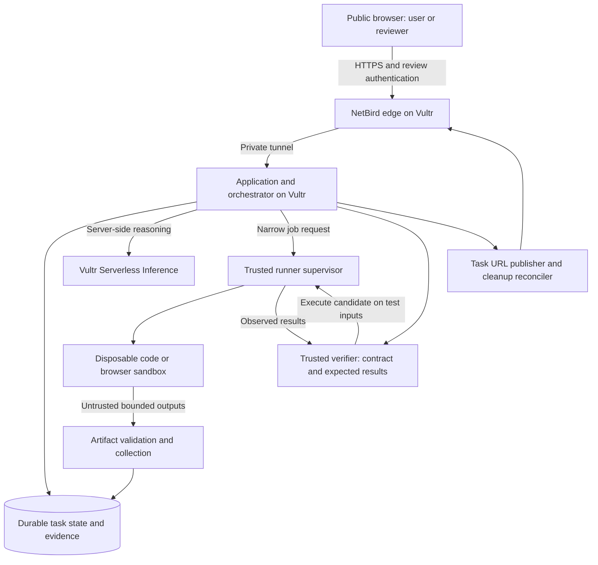

# A buildable architecture and execution plan

Design proposal, September 26, 2026. Nothing here has been deployed or runtime-tested. This blueprint turns the research into a starting plan; selecting a project and validating the platform are the next decisions. Exact commands, versions and capability evidence live in memos 02–04.

## Default starting point

For a small team, start with **one bounded code-repair workflow**, a custom typed agent loop, offline gVisor execution, immutable outcome checks and a review page. A blocked import adapter is a particularly concrete fixture: repair the mapping, execute an import into a disposable task database, then export the validated result. It can grow into ProofPatch or Ops Rehearsal without beginning as a general agent platform.

Use the stack the team can debug fastest. A reasonable Python-heavy version is React/TypeScript UI + FastAPI + PostgreSQL or SQLite + a worker + Docker/gVisor. A TypeScript-heavy team can keep the API/worker in Node and run Python only inside prepared task images. These are proposed choices, not sponsor requirements. SQLite is simplest for a single worker; PostgreSQL helps with concurrent claims and multi-user state. Supabase and Coolify are conveniences, not mandatory dependencies.

## Trust and deployment boundaries



Minimum topology can place the app and trusted runner on one workload VM with separate processes and separate task containers; that meets the brief's separation model when implemented correctly. A stronger topology puts the runner on its own VM so the app's inference key is not on the execution host. The NetBird public edge is another VM when self-hosted. Choose two or three VMs based on time and control-plane complexity; do not claim a separate host boundary if it is only a process boundary.

The public app VM has no public inbound **application** ports when using the bonus architecture. The public NetBird edge still serves HTTPS and its required control-plane ports. Use the actual bind and firewall advice in [memo 04](04-netbird-bonus.md); blindly binding to loopback can make peer routing fail.

### Authority table

| Component | May hold | May do | Must not expose |
|---|---|---|---|
| Web frontend | User session, task IDs | Submit task, view scoped results, approve a specific proposal | Vultr keys, worker credentials, NetBird admin token |
| Orchestrator | Inference key, DB access | Plan, validate tool arguments, manage budgets | Raw runtime API or arbitrary host options |
| Runner supervisor | Local runtime authority; narrow app-to-worker auth | Create, inspect, stop, destroy fixed sandbox profiles | Docker socket or runtime control socket to guest/browser |
| Sandbox | Source/input copies and task scratch | Execute generated work within fixed policy | Host filesystem, other runs, app credentials, provider keys |
| Verifier | Contract, expected outputs, immutable baseline | Compare externally observed results | Hidden expected answers to the generator |
| URL publisher | Scoped publication authority | Create/revoke intended review endpoints | Arbitrary private services or worker management ports |

“No secrets in the sandbox” means more than hiding environment-variable names. Cookies, mounted `.env` files, inherited process environments, command-line arguments and model SDK default credentials all count. The model call happens in the orchestrator; code/browser actions happen in the sandbox. If a library insists on running its model client inside the guest, adapt its execution layer or choose a simpler loop.

## Agent loop

1. Validate task input and create its durable identity before asking a model to act.
2. Send bounded task context and tool schema to the selected Vultr model.
3. Validate the returned action locally; reject unknown fields, unsupported tools and oversized payloads.
4. Check remaining attempts, wall time, token budget, allowed paths and workload policy.
5. Dispatch to the runner. Record a started event with immutable policy and image identity.
6. Collect bounded stdout/stderr, exit condition and permitted artifacts. Mark all as untrusted observations.
7. If recoverable, send the relevant error back to Vultr inference with the remaining budget. Otherwise stop.
8. Verify independently; generate the user-facing explanation only from the observed result.
9. Retain permitted artifacts and destroy the execution sandbox. A read-only review session may continue under its own explicit lease; close/expire that session to revoke its URL. Retry both kinds of cleanup independently after crashes.

Initial design targets: at most five model steps, at most two repair attempts, one active job per reviewer, two concurrent jobs total, and a short per-execution deadline. These numbers are hypotheses to tune after a benign smoke test, not current measured limits. Browser tasks usually need more memory and steps than a small pure-function repair.

Do not use model confidence as authority to increase budgets, install packages, publish ports or approve side effects. Keep package dependencies preinstalled in a pinned image. If an import is missing, report the unsupported dependency or use a pre-approved image; do not allow arbitrary installation on the host.

## A verifier that actually adds evidence

For a small adapter/function task, keep expected results and invariants in the trusted verifier. Send test inputs to the candidate in its sandbox; parse the returned values and compare them outside that sandbox. Treat extra text, invalid JSON, missing output and exceeded resource budgets as failures. This gives a cleaner boundary than running agent-editable code in the same process as the oracle.

Use a visible example plus at least one held-out boundary case. Include an explicitly labeled wrong-patch verifier self-test to establish the checker can fail; do not pretend that patch was model-generated. Run the actual model repair live on the chosen fixture. Preserve ambiguity rather than forcing every case into “pass.”

For general repositories, a clean second environment and unchanged tests help reproducibility, but code under test can still affect the test runner or fabricate stdout. Restrict allowed patch paths, verify original tests/config, run a trusted harness, and state what the test boundary actually guarantees. “All tests passed” is not a universal correctness claim.

Evidence manifest proposal:

```json
{
  "run_id": "generated-by-server",
  "input_sha256": "...",
  "baseline_sha256": "...",
  "candidate_sha256": "...",
  "image_digest": "sha256:...",
  "runtime": "pinned-runtime-name-and-version",
  "policy_version": "...",
  "contract_version": "...",
  "model_id": "from-current-vultr-catalog",
  "attempt": 1,
  "started_at": "ISO-8601",
  "finished_at": "ISO-8601",
  "exit_reason": "completed-or-timeout-or-error",
  "checks": [{"id": "unique-order-ids", "passed": true}],
  "artifacts": [{"name": "result.json", "sha256": "...", "bytes": 0}],
  "cleanup_status": "destroyed-or-pending"
}
```

Values above are placeholders, not a test result. Hashing permits consistency checks against recorded data; it does not authenticate the entire execution history or establish formal proof.

## Small API and data model

Proposed public endpoints:

| Endpoint | Responsibility |
|---|---|
| `POST /runs` | Validate input, record run, enqueue work |
| `GET /runs/{id}` | Current state, result summary, permitted actions |
| `GET /runs/{id}/events` | Server-sent events with sequence IDs and reconnect support |
| `POST /runs/{id}/cancel` | Idempotent cancellation; wait for observed cleanup |
| `GET /runs/{id}/artifacts/{artifact_id}` | Authorized download of validated output |
| `POST /runs/{id}/approvals` | Approve exact candidate/state version if workflow needs it |
| `POST /runs/{id}/review-session` | Create restricted task publication through trusted publisher |

The browser never sends Docker flags or arbitrary image names. Store `runs`, ordered `events`, `artifacts`, `approval_proposals` and `review_sessions`. Even with a small database, make run ownership explicit and check it on every read and write.

Suggested state flow:

```text
queued -> planning -> executing -> verifying -> completed
                     |     ^          |
                     v     |          v
                  retrying +     awaiting_approval -> applying -> completed

any active state -> cancelling -> cancelled
any active state -> failed

orthogonal cleanup_status: pending -> cleaning -> cleaned (or retry_pending)
```

Keep cleanup status separate from task success: a result can be computed while teardown is still pending. A retry should increment attempt count without overwriting previous evidence. Reconnecting the UI should replay events from persistent state rather than restarting execution.

## Approval and task URL lifetimes

Approval payload must name the exact candidate hash, input/state version, allowed action, target, actor and expiration. If any changes before apply, require a new preview. Use an idempotency key and a conditional state update: identical retries return the recorded outcome without applying again; changed or stale proposals are rejected. The enforcing code lives outside the sandbox, ideally at the controlled target boundary. A UI button alone cannot stop arbitrary browser code from issuing a request.

Keep the judging entrance as a normal durable NetBird service. Give each task a separate review session backed by a trusted read-only gateway bound to exactly one run, or equivalent enforced hostname/session mapping. NetBird gates a service/port, not `/runs/{id}`; never expose the full app API as if a unique task URL alone restricted it. Stop its exposure gracefully before reusing its port. Store actual service ID/URL and observed revocation, not just desired expiry. NetBird's crash TTL is a recovery mechanism with timing caveats; do not make exact 90-second disappearance a correctness assumption.

Execution and review have separate lifetimes: destroy the execution sandbox after collection, keep the review gateway only while its explicit session lease is active, and expire that gateway with the review session. The bonus permits session-bound URLs, so demonstrate closing that session. Durable artifacts can remain behind the stable authenticated product entrance. If claiming a URL bound directly to execution rather than review, revoke it when execution ends.

For C1, running a business simulator inside the app process is insufficient. The project must actually execute code or operate a real browser in the Vultr sandbox. An adapter repair/import rehearsal naturally gives Ops Rehearsal that concrete execution step. If only trusted application actions are needed, identify it as a C2 design instead of overstating C1 compliance.

## Work plan with decision gates

These are work-budget suggestions from the start of implementation, not a claim about how much event time remains. Always preserve time before the guide's Sunday noon submission deadline.

| Phase | Suggested budget | Exit evidence | If it fails |
|---|---:|---|---|
| Platform spike | 60–90 min | Vultr app health, real inference, benign isolated execution, teardown | Change runtime/profile/model; verify access with sponsor staff |
| Distinguishing workflow | 2–3 h | Failed baseline → real agent repair → held-out check → artifact | Narrow task and input format; remove frameworks/features |
| Product surface | 2–3 h | Upload/select task, live progress, output, failure and cancellation | Simplify UI; keep one clear flow |
| Boundary checks | 1–2 h | Resource limit, isolation, malicious output, cleanup, authorization | Fix the boundary before public arbitrary execution |
| NetBird integration | 1–2 h | Stable public entry + role gate + task URL revoked | Keep stable gate first; document incomplete optional tier |
| Reliability + recording | 2–3 h | Repeated live success, fresh browser, 60s video and 3min rehearsal | Freeze scope; fix observed failures |

Do not fill the full 24.5 hours with planned feature work. Reserve time for account activation, DNS, image pulls, integration failures, meals and rest. Parallelize by interfaces rather than four people editing the same orchestration file.

### Team allocation

| Role | Owns | Contract with other roles |
|---|---|---|
| Runtime engineer | Sandbox, quotas, cleanup, artifact collector | Narrow job request and result manifest |
| Agent/backend engineer | Vultr model adapter, state, retries, verifier | Typed actions and event stream |
| Product/frontend engineer | Task experience, diff/artifact review, approvals | Stable API and event types |
| Integration/demo engineer | NetBird, deployment, fixtures, evidence, README/video | Stable service IDs, access and teardown behavior |

For one person: use offline code, one fixture, a custom loop, a single worker and a basic result page first. For two: combine runtime/deployment and agent/UI. For three: share demo work and nominate one integration owner.

## Infrastructure and cost decisions

Use the live pricing data in [memo 02](02-vultr-platform-and-inference.md), not a remembered monthly price. Total cost includes app/worker/edge VM hours, storage, snapshots, egress, inference tokens and any noncovered service. Stopped instances may continue billing; destruction and resource accounting matter. Credits do not prove a service is enabled or covered.

Estimate model cost as `input_tokens × input_rate + output_tokens × output_rate`, with the correct unit from the live catalog. A repair loop repeats context and may emit reasoning tokens; record actual usage fields. Cap requests and concurrency at the application layer to avoid an unrestricted public credit-spending endpoint.

Prefer cloud compute without GPUs: C1 reasoning uses managed inference and the event says GPUs are unavailable. Select region based on current availability and observed inference/worker latency, not only proximity to the venue.

## Deliberate exclusions from the first version

No Kubernetes, broad MCP marketplace, external account write permissions, arbitrary browser profiles, GPU serving, multi-language package installation, custom hypervisor, generalized simulator or entire benchmark suite. These can be future work after a useful task is consistently executed and verified.
